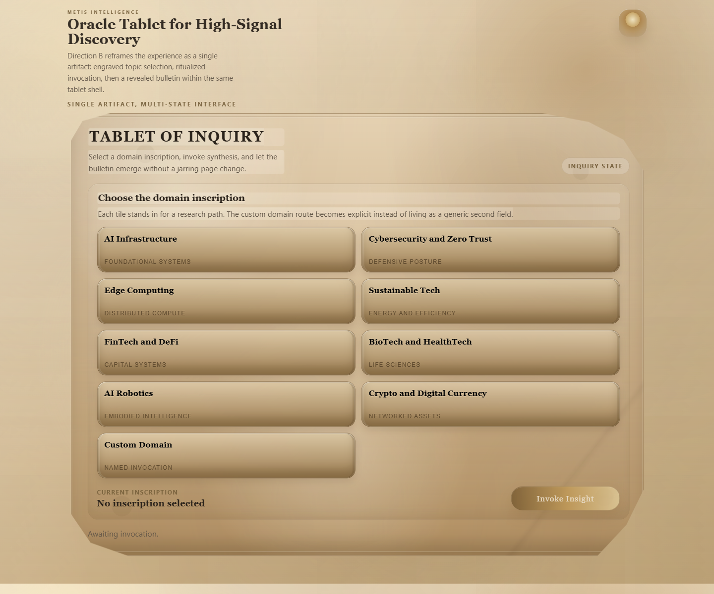
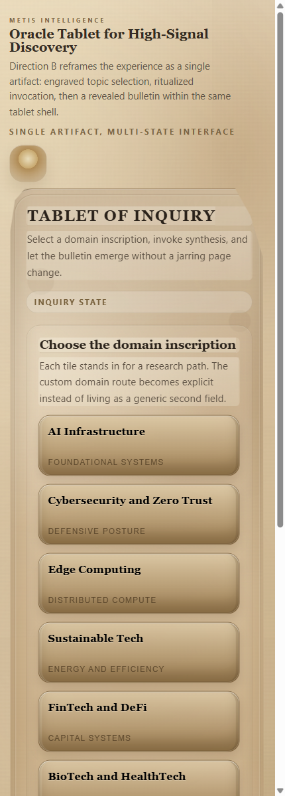
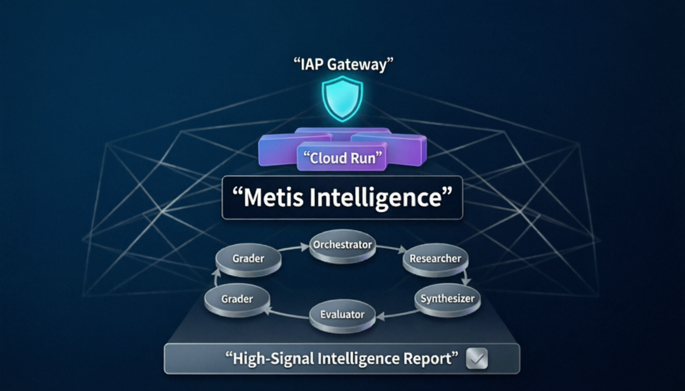

<p align="center">
  
</p>

<h1 align="center">Metis</h1>

<p align="center">
  <strong>Mythic intelligence for high-signal technical discovery.</strong>
</p>

<p align="center">
  <a href="https://github.com/ai-craftsman404/Metis-Intelligence/actions/workflows/metis-ci.yml">
    
  </a>
</p>

<p align="center">
  Metis turns domain research into a guided ritual: choose a field, invoke synthesis, and receive a structured intelligence bulletin through a product experience designed to feel memorable from the first screen.
</p>

<p align="center">
  <em>Part research engine. Part interface artifact. Part product statement.</em>
</p>

<table>
  <tr>
    <td width="70%">
      
    </td>
    <td width="30%">
      
    </td>
  </tr>
  <tr>
    <td align="center"><strong>Tablet-style desktop interface</strong></td>
    <td align="center"><strong>Mobile presentation</strong></td>
  </tr>
</table>

## Why Metis Feels Different

Most research tools look like admin panels. Metis is designed to feel like consultation with an intelligence artifact.

- The interface uses mythic framing instead of generic dashboard language.
- Research is structured as invocation, synthesis, and revealed bulletin.
- The visual system gives the repo an identity people can remember, not just functionality they can inspect.
- The result is a project that reads more like a product and less like a prototype dump.

## What Metis Does

- Surfaces high-signal developments across selected technical domains.
- Synthesizes research into a structured report with executive summary, key signals, risks, actions, and sources.
- Supports predefined domains such as AI infrastructure, cybersecurity, robotics, and digital currency.
- Supports custom domains for ad hoc research.

## Multi-Agent Intelligence Loop

Metis is not a single-prompt wrapper. It uses a multi-agent style workflow built around distinct responsibilities:

- an orchestrator that coordinates the full research run
- a research phase that gathers live web inputs
- a synthesis phase that drafts the report
- an evaluator that refines structure, presentation, and readability
- an adversarial grader that critiques the output before the final result is returned

That loop is what gives Metis its character: not just generating text, but iterating toward a more defensible intelligence brief.

## Experience Snapshot

- Choose from predefined technical domains or define a custom domain.
- Run an orchestrated research flow tuned for signal over noise.
- Receive a polished report with synthesis, risks, actions, and source links.
- Use Metis through a browser UI or call the backend directly.

## How It Works

Metis combines a domain-aware orchestrator, live web search, and an LLM-backed synthesis step.

- The UI sends a research request to the FastAPI backend.
- The orchestrator applies domain-specific instructions and report formatting rules.
- Search is performed against the public web.
- The evaluator and grader push the report through an internal quality loop.
- The final report is returned as structured markdown and rendered inside the Metis interface.

## GCP-Native Architecture

Metis is designed to work cleanly with Google Cloud native services.

<p align="center">
  
</p>

### Vertex AI

When `OPENROUTER_API_KEY` is not set, Metis uses Google Cloud Vertex AI as its default model runtime.

- Vertex AI is initialized with `GOOGLE_CLOUD_PROJECT` and `GOOGLE_CLOUD_LOCATION`.
- The orchestrator, evaluator, and grader can all operate through the Vertex-backed path.
- This makes Metis deployable as a GCP-native intelligence workflow rather than only a third-party API client.

### Identity-Aware Proxy (IAP)

For deployed validation and controlled access, Metis can be placed behind Google Cloud IAP on Cloud Run.

- Users authenticate with Google before reaching the application.
- Access can be restricted to explicitly authorized identities.
- The app itself stays focused on research and synthesis while access control remains at the infrastructure layer.
- This gives Metis a cleaner security posture for private demos and controlled stakeholder access.

## Built For

- founders exploring emerging technical sectors
- operators who need concise intelligence rather than raw search results
- developers experimenting with LLM-native research workflows
- anyone who wants a stronger product shell around AI-assisted analysis

## Stack

- Python
- FastAPI
- Multi-agent orchestration with evaluator and grader stages
- GCP-native Vertex AI or OpenRouter-compatible LLM access
- Google Cloud IAP for secure browser access in deployed environments
- Simple web UI served directly from the app

## Quickstart

### 1. Install dependencies

```bash
pip install -r requirements.txt
```

### 2. Configure environment variables

Copy `.env.example` to `.env` and fill in the values you want to use.

Metis supports two runtime modes:

- `OPENROUTER_API_KEY` set:
  Metis uses OpenRouter for generation.
- `OPENROUTER_API_KEY` unset:
  Metis initializes Vertex AI and expects Google Cloud project/location config.

### 3. Secure deployed access

For Cloud Run deployments, Metis can be protected with Google Cloud IAP so browser access is authenticated and policy-controlled before a user reaches the app.

### 4. Run locally

```bash
python app.py
```

Then open [http://localhost:8080/ui](http://localhost:8080/ui).

## API

### `GET /ui`

Loads the Metis browser interface.

### `GET /domains`

Returns the available research domains.

### `POST /research`

Request body:

```json
{
  "domain_id": "1",
  "custom_domain": null
}
```

Example:

```bash
curl -X POST http://localhost:8080/research \
  -H "Content-Type: application/json" \
  -d "{\"domain_id\":\"7\"}"
```

## Configuration

Key environment variables:

- `GOOGLE_CLOUD_PROJECT`
- `GOOGLE_CLOUD_LOCATION`
- `OPENROUTER_API_KEY`
- `OPENROUTER_MODEL`
- `OPENROUTER_BASE_URL`
- `OPENROUTER_APP_NAME`
- `OPENROUTER_HTTP_REFERER`

## Deployment Model

Metis supports a GCP-native deployment shape built around:

- Cloud Run for app hosting
- Vertex AI for model execution
- IAP for secure browser access

That combination is useful when you want Metis to behave like a private intelligence product rather than an open demo endpoint.

## Notes

- This repo is set up so local secrets, deployment notes, logs, and validation artifacts stay out of the public repo by default.
- The current UI is intentionally product-forward rather than admin-heavy, so the README is also meant to sell the feel of the project at a glance.
